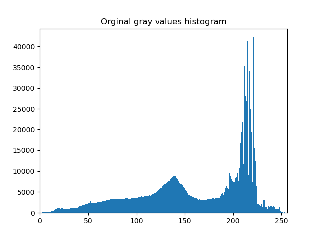
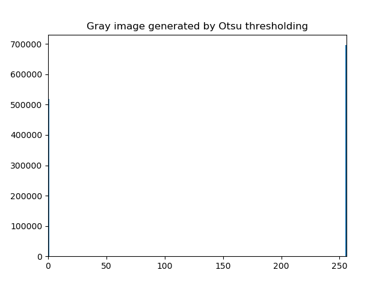
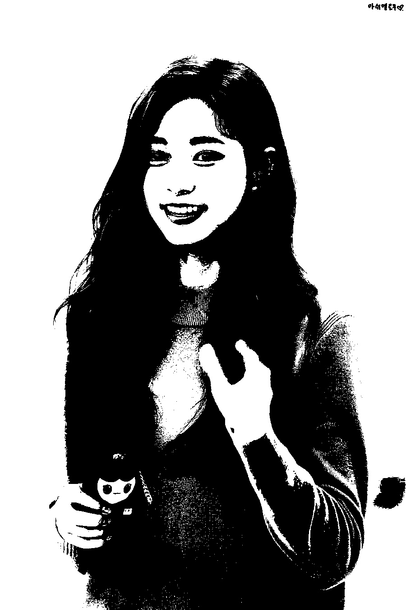

# Otsu Thresholding

> AUthor : Ya Chen<br>
> Date : 2021 / 5 / 6

---

<br>
<div>

## Description

Implement the `Otsu Thresholding` method

</div>
<br>
<br>
<div>

## Execution

Compile Skeletonization.py to compile the program, and enter the whole image name you want to be Skeletonized.<br>
<br>
For Linux OS :

```
>>> make
or
>>> python3 Otsu_thresholding.py
```

For Windows 10 :

```
>>> python Otsu_thresholding.py
```

</div>
<br>
<br>
<div>

## In-Output Example

### Input:

&emsp;&emsp; Original Image : Chou-Tzu-yu.jpg<br>
&emsp;&emsp;&emsp;&emsp;&emsp;&emsp;&emsp;&emsp;&emsp;&emsp;


### Output:

&emsp;&emsp; Orginal gray values histogram :<br>
&emsp;&emsp;&emsp;&emsp;&emsp;&emsp;&emsp;&emsp;&emsp;&emsp;


&emsp;&emsp; Gray image generated by Otsu thresholding :<br>
&emsp;&emsp;&emsp;&emsp;&emsp;&emsp;&emsp;&emsp;&emsp;&emsp;


&emsp;&emsp; Skeletonized-nice-work :<br>
&emsp;&emsp;&emsp;&emsp;&emsp;&emsp;&emsp;&emsp;&emsp;&emsp;


</div>
